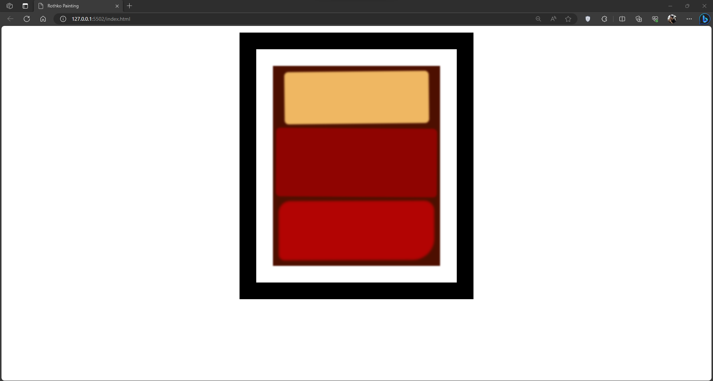

# RothkoPainting
The purpose of this repo is to monitor my progress in learning HTML and CSS by making a basic Rothko Painting. I am utilizing the freeCodeCamp "Learn CSS Box Model by Building a Rothko Painting" for this repo.

## Screenshot

## What I Learned
1. Understand more about the padding, border, and margin
2. Understand more about the box model
3. New syntax for CSS
